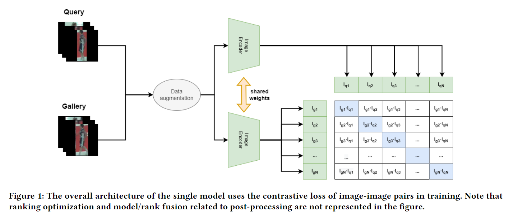

[[Paper]](https://dl.acm.org/doi/10.1145/3606038.3616168)[[Challenge]](http://mmsports.multimedia-computing.de/mmsports2023/challenge.html)

Code for the paper: `Exploring Loss Function and Rank Fusion for Enhanced Person Re-identification`

## Setup environment
Clone the repo:
  ```bash
  git clone https://github.com/LIRENDA621/MMSports2023_-Player_Reidentificatio_Challenge.git
  cd MMSports2023_-Player_Reidentificatio_Challenge
  ```  
Create conda environment:
```bash
   pip install -r requirements.txt
```


 

## Approach



## Usage

Steps for Training and Evaluation:

1. get data: `download_data.py`
2. create DataFrames: `preprocess_data.py`
3. training: `train.py`
4. evaluation: `evaluate.py`
5. final predictions: `predict.py`


All settings are done by the configuration dataclass at the beginning of the scripts.

`download_data.py` downloads and unzips the challenge data from the provided [challenge toolkit](https://github.com/DeepSportRadar/player-reidentification-challenge).
